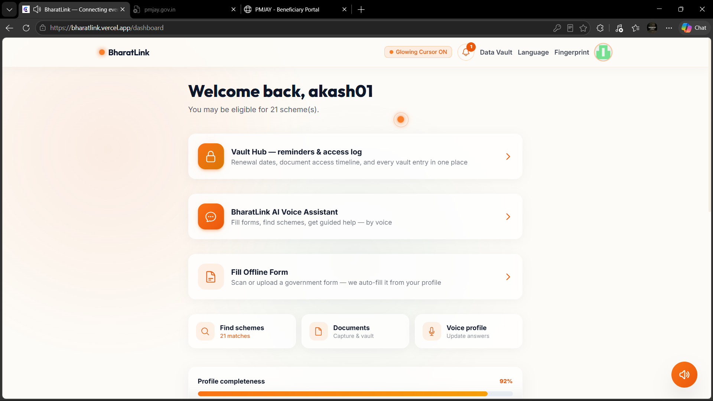
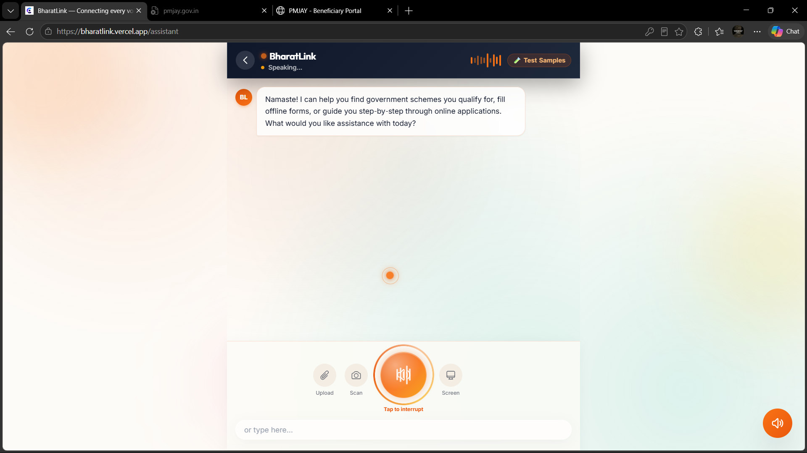
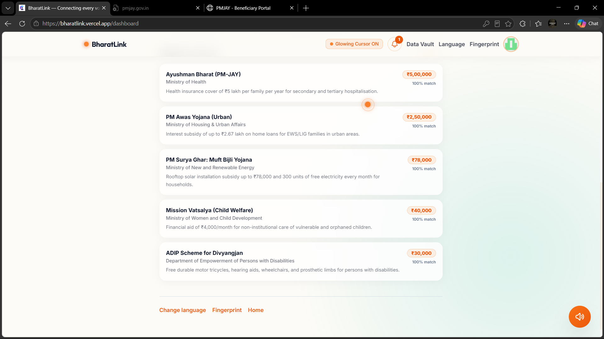
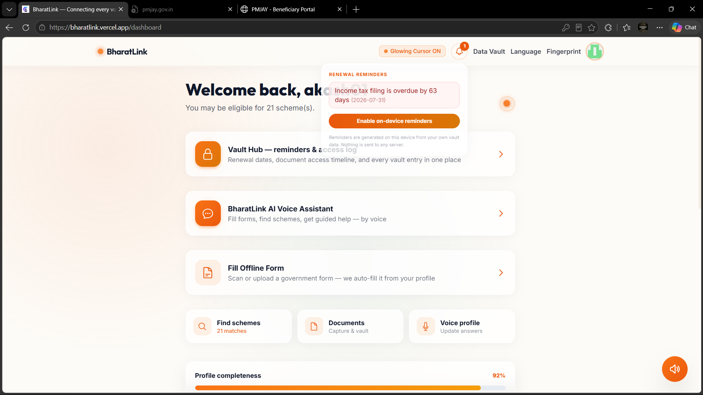
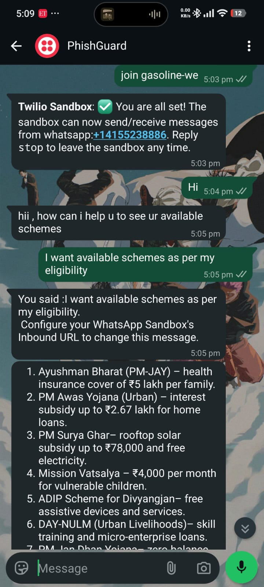
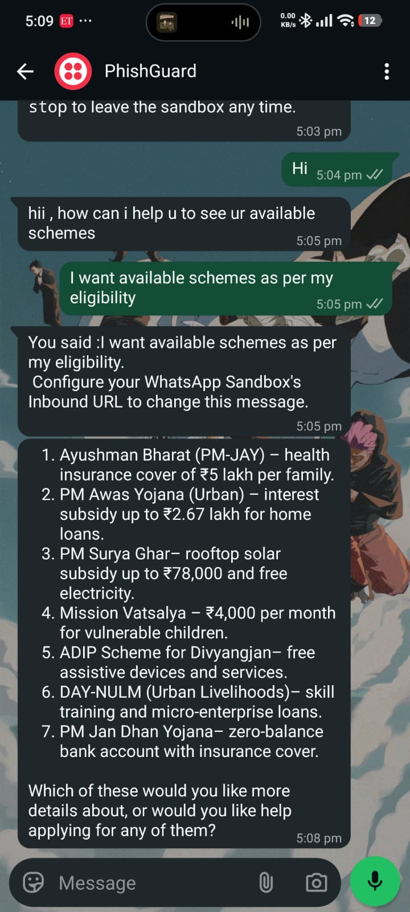

# BharatLink

> **Government services, in your language — driven by an AI that acts, not just answers.**

BharatLink is an agentic AI assistant purpose-built for India's citizens. It helps people discover welfare schemes they qualify for, fill paper and digital government forms, and complete online applications — entirely through **voice**, in **13 Indian languages**.


## 🌐 Try it live

**https://bharatlink.vercel.app**

---

## Screenshot Gallery

| Landing page | Dashboard | AI voice assistant |
|:---:|:---:|:---:|
|  |  |  |

| Eligible schemes | Renewal reminders + Vault Hub |
|:---:|:---:|
|  |  |

---

## The Problem

Over 100 million Indians are eligible for government welfare programs but never access them. The barriers are real: forms only exist in languages many can't read, portal websites are designed for bureaucrats not citizens, and the eligibility rules are buried in policy documents nobody has time to decode.

BharatLink eliminates all of those barriers at once — using an AI agent that speaks your language, reads your documents, matches you to schemes, and walks you through applications step by step.

---

## How It Works

A single voice message kicks off a **server-side agentic loop** with a self-healing multi-brain chain:

1. Your message (spoken or typed) arrives at the Next.js API route
2. The **brain chain** reasons about what needs to happen — first success wins:
   - **OpenRouter** (GPT-4o-mini) — premium path
   - **Groq** (GPT-OSS 120B) — free, LPU-fast
   - **Gemini** (native function-calling, dual keys with rotation)
   - **NVIDIA NIM** (Kimi K3)
   - **Local Ollama** — offline resilience
3. The model calls any combination of **19 purpose-built tools** — scanning a document, checking scheme eligibility, filling a PDF, generating it with self-verification, or narrating portal steps
4. Tool results feed back into the model, which decides whether to call more tools or respond — streamed **live to the UI** as action events
5. The final answer is spoken aloud in your language via **Sarvam Priya** (native Indic voices)

If any brain is down (out of credits, rate-limited, quota exhausted), the next one takes over automatically — **the assistant never goes silent**, and raw provider errors never reach the user.

One question like *"What housing schemes am I eligible for and how do I apply?"* might trigger 5 tool calls: read profile → match schemes → get scheme details → open portal → narrate steps. You just listen.

---

## Key Features

### 🗣 Talk in Your Language
13 Indian languages, voice in and voice out. Speech recognition by **Groq Whisper**, spoken replies in native Indic voices by **Sarvam Bulbul**. Pick your language once — every screen, every reply switches.

### 🧠 An Agent That Acts
19 purpose-built tools let the agent check your profile against 50+ real government schemes, open official portals, extract form fields from a photo, fill them from your encrypted vault, and narrate exactly what to type on government websites.

### 📄 Forms → Filled PDFs, Verified
Upload or photograph any government form. The agent detects the language, extracts every field, auto-fills from your profile, and generates a completed PDF — then **reads the PDF back and verifies** every field it wrote.

### 🎯 Multi-Step Missions
Give it a big goal — *"apply for PM-KISAN end to end"* — and the agent plans the steps, shows a live progress checklist, and works through them across turns.

### 📇 Aadhaar & Document Scanning
Point your camera at any ID or form. Vision AI extracts the details (with exact name transcription — no guessing), and everything saves to your encrypted on-device vault.

### 💬 WhatsApp Assistant
The same agent replies on **WhatsApp** — text and even **voice notes** (transcribed automatically). Great for feature phones and sharing.

### 🔔 Vault Hub — Reminders & Access Log
Renewal bell alerts you before deadlines (LPG KYC, tax filing, insurance premiums). A **Security & Access Log** shows every time any part of the app read your data — metadata only, never the values.

### 🔒 Privacy by Design
All personal data is **AES-GCM encrypted** and stored only in your browser's IndexedDB. The encryption key lives on your device — clear it and the vault is gone by design. Nothing is ever stored server-side.

---

## 💬 WhatsApp in Action

A real conversation with the live bot — user asks in plain language, the agent replies with schemes matched to their profile, formatted for WhatsApp:

| Conversation | Full reply |
|:---:|:---:|
|  |  |

**Transcript:**

> **User:** Hi
>
> **BharatLink:** Hii, how can I help you to see your available schemes?
>
> **User:** I want available schemes as per my eligibility
>
> **BharatLink:** 1. **Ayushman Bharat (PM-JAY)** — health insurance cover of ₹5 lakh per family. 2. **PM Awas Yojana (Urban)** — interest subsidy up to ₹2.67 lakh for home loans. 3. **PM Surya Ghar** — rooftop solar subsidy up to ₹78,000 and free electricity. 4. **Mission Vatsalya** — ₹4,000 per month for vulnerable children. 5. **ADIP Scheme for Divyangjan** — free assistive devices and services. 6. **DAY-NULM (Urban Livelihoods)** — skill training and micro-enterprise loans. 7. **PM Jan Dhan Yojana** — zero-balance bank account with insurance cover.
>
> *Which of these would you like more details about, or would you like help applying for any of them?*

## WhatsApp Chatbot Setup

BharatLink's agent also answers on WhatsApp (text + voice notes). The webhook is live at:

```
https://<your-deployed-domain>/api/whatsapp/webhook
```

**Easiest path — Twilio WhatsApp Sandbox (free):**

1. Sign up at [console.twilio.com](https://console.twilio.com) → **Messaging → Try it out → Send a WhatsApp message**
2. Join the sandbox from your phone (send the shown code to the sandbox number)
3. In the sandbox settings, set **"When a message comes in"** to:
   ```
   https://your-domain.vercel.app/api/whatsapp/webhook   (method: POST)
   ```
4. Message the sandbox number: *"What schemes can a farmer with 2 acres get?"* — the agent replies right in WhatsApp, with scheme details formatted for chat.

Voice notes work too — they're transcribed with Groq Whisper before the agent sees them.

---

## Tech Stack

| Layer | Technology |
|---|---|
| **Framework** | Next.js 15 (App Router), TypeScript 5.7, React 19 |
| **Agent brain chain** | OpenRouter (GPT-4o-mini) → Groq (GPT-OSS 120B) → Gemini function-calling → NVIDIA NIM (Kimi K3) → local Ollama |
| **Speech-to-text** | Groq Whisper large-v3 (browser Web Speech as first try) |
| **Text-to-speech** | Sarvam Bulbul v3 (native Indic voices) → OpenAI GPT-Audio → browser voices |
| **Vision (OCR / forms / PDFs)** | Gemini + GPT-4o-mini with token caps and model failover |
| **PDF engine** | pdf-lib + @pdf-lib/fontkit (AcroForm fill + overlay + summary) |
| **Auth** | Clerk (Google OAuth, WebAuthn biometric) |
| **Encryption** | Web Crypto AES-GCM, device-bound keys, IndexedDB |
| **Internationalisation** | i18next — 13 languages, native scripts |
| **Styling** | Tailwind CSS 3 — Coral & Slate glassmorphism |
| **Testing** | Playwright + built-in QA suite (`node scripts/final-qa.mjs`) |

---

## Privacy & Security

- **No data leaves your device.** All profile fields are AES-GCM encrypted and stored only in IndexedDB.
- **The encryption key lives in localStorage.** If you clear it, the data is permanently unrecoverable — by design.
- **Document images** are sent to the vision API to extract text, then immediately discarded. Nothing is persisted server-side.
- **No server-side database.** The API routes are stateless; they never write user data anywhere.
- **In-app access log** records every vault read/write (metadata only — never values) so you can audit the app itself.

---

## Getting Started

### Prerequisites

- Node.js 18+
- API keys (free tiers are enough): [OpenRouter](https://openrouter.ai/keys), [Groq](https://console.groq.com/keys), [Google AI Studio](https://aistudio.google.com/apikey) (Gemini), [Sarvam AI](https://dashboard.sarvam.ai), Clerk
- Optional: [NVIDIA NIM](https://build.nvidia.com) key, a local [Ollama](https://ollama.com) install

### Setup

```bash
git clone https://github.com/okegy/Bharat.AI.git
cd Bharat.AI
npm install
```

Copy the env example and fill in your keys:

```bash
cp .env.example .env.local
```

```env
NEXT_PUBLIC_CLERK_PUBLISHABLE_KEY=pk_test_...
CLERK_SECRET_KEY=sk_test_...
OPENROUTER_API_KEY=sk-or-v1-...
GROQ_API_KEY=gsk_...
GEMINI_API_KEY=...
SARVAM_API_KEY=...
# Optional extras:
NVIDIA_API_KEY=nvapi-...
OLLAMA_URL=http://localhost:11434
```

```bash
npm run dev
```

Open [http://localhost:3000](http://localhost:3000).

> Multiple Groq or Gemini keys? Add them as `GROQ_API_KEY_2`, `GEMINI_API_KEY_2`, … — every key is its own free rate pool and they stack automatically.

---

## Supported Schemes (50+)

Ration Card (NFSA) · PM-KISAN · PM Fasal Bima Yojana · PM Awas Yojana (Urban + Rural) · Ayushman Bharat PM-JAY · PM Surya Ghar: Muft Bijli · Sukanya Samriddhi Yojana · PM Matru Vandana Yojana · National Pension Scheme · PM Ujjwala Yojana · National Scholarship Portal · PM Mudra Yojana · Mission Vatsalya · ADIP Scheme for Divyangjan · Skill India Mission · and many more across agriculture, health, housing, education, and employment.

---

## License

[MIT](./LICENSE) © 2026 okegy
