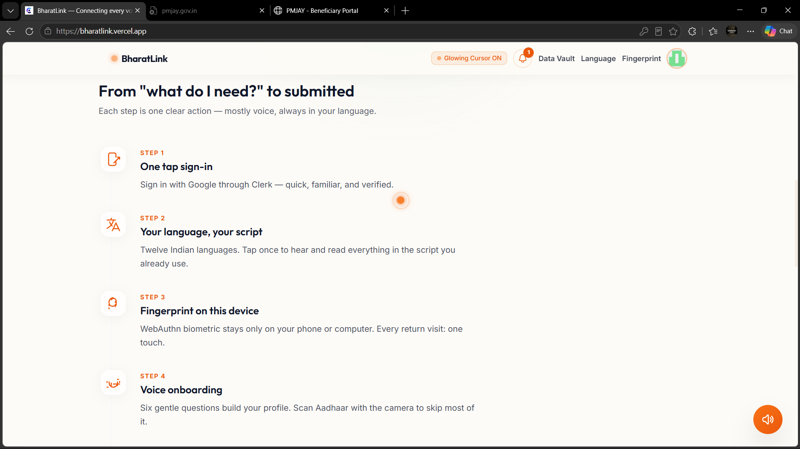
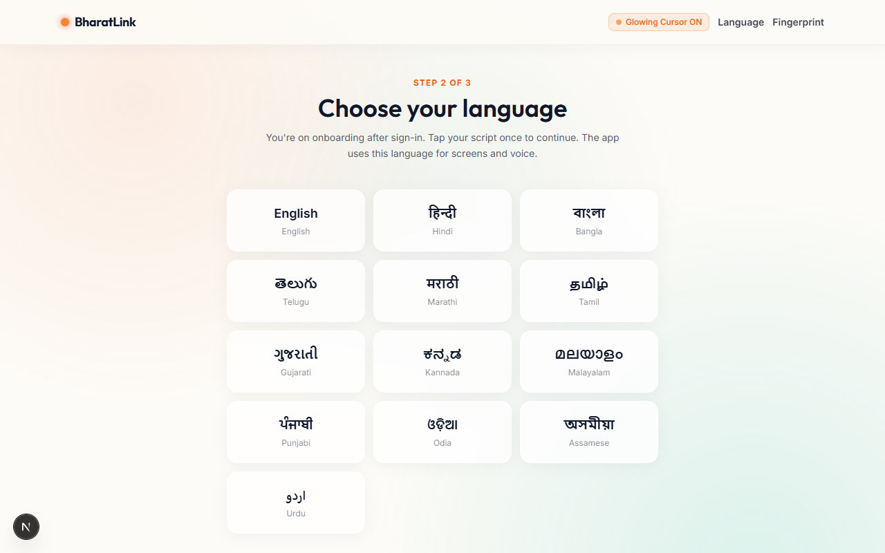
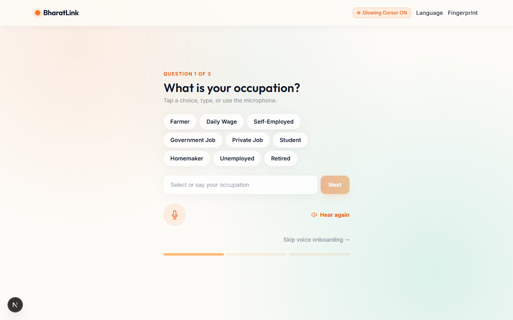
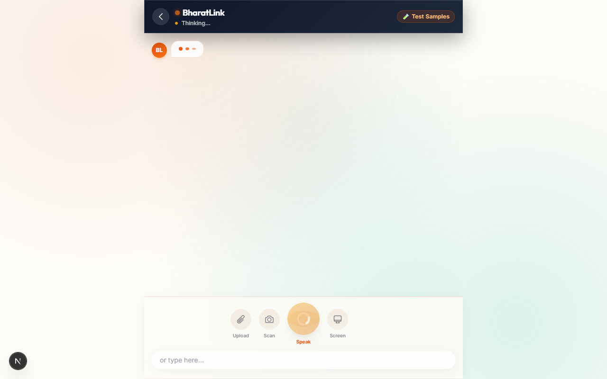
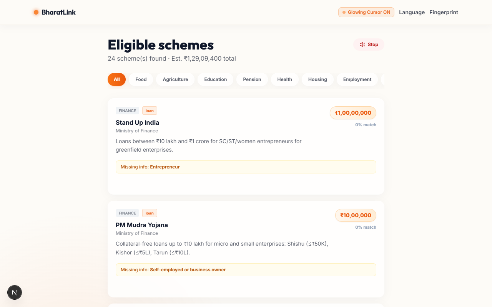
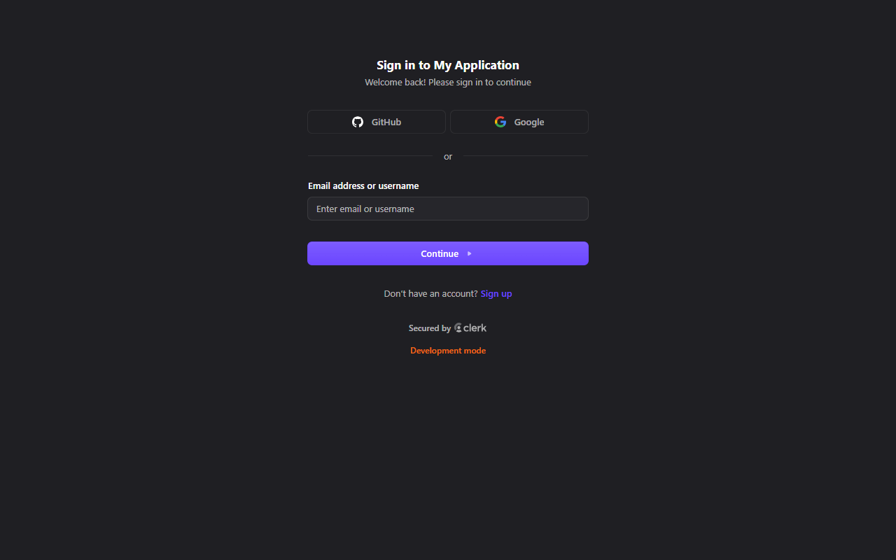

# BharatLink

> **Government services, in your language — driven by an AI that acts, not just answers.**

BharatLink is an agentic AI assistant purpose-built for India's 1.4 billion citizens. It helps people discover welfare schemes they qualify for, fill paper and digital government forms, and complete online applications — entirely through voice, in 13 Indian languages.

[](./LICENSE)
[](https://nextjs.org)
[](https://typescriptlang.org)
[](https://tailwindcss.com)
[](#)
[](https://github.com/okegy/Bharat-AI)

---

## ▶ Demo

> **[Watch the live demo →](#)** *(upload to YouTube/Loom and replace this link)*

---

## Screenshot Gallery

|  |  |  |
|:---:|:---:|:---:|
| Landing page | Choose your language | Voice onboarding |

|  |  |  |
|:---:|:---:|:---:|
| AI voice assistant | Eligible schemes | Personal dashboard |

---

## The Problem

Over 100 million Indians are eligible for government welfare programs but never access them. The barriers are real: forms only exist in languages many can't read, portal websites are designed for bureaucrats not citizens, and the eligibility rules are buried in policy documents nobody has time to decode.

BharatLink eliminates all of those barriers at once — using an AI agent that speaks your language, reads your documents, matches you to schemes, and walks you through applications step by step.

---

## How It Works

A single voice message kicks off a **server-side agentic loop**:

1. Your message (spoken or typed) arrives at the Next.js API route
2. **Gemini 2.5 Flash** (via OpenRouter) reasons about what needs to happen
3. The model calls any combination of **15 purpose-built tools** — scanning a document, checking scheme eligibility, filling a PDF, or narrating portal steps
4. Tool results feed back into the model, which decides whether to call more tools or respond
5. The final answer is spoken aloud in your language via **OpenAI TTS**

One question like *"What housing schemes am I eligible for and how do I apply?"* might trigger 5 tool calls: read profile → match schemes → get scheme details → open portal → narrate steps. You just listen.

---

## Features

### 🗣 Talk in Your Language
Choose from 13 Indian languages at startup. Every screen, every voice prompt, every form label switches automatically. The AI reasons multilingually — it can understand Hindi speech and fill a Tamil-language form.

### 📇 Scan Your Aadhaar
Point your camera at your Aadhaar card. The agent reads it using **vision OCR**, extracts name, date of birth, gender, address, father's name, and Aadhaar number, then encrypts everything locally on your device. Nothing ever leaves the browser.

### 🗂 Discover Your Schemes
Tell the agent your occupation, income, and category. It autonomously scores your profile against **50+ central government schemes** and returns a ranked list of what you qualify for — including estimated annual benefit amounts.

### 📝 Fill Offline Forms
Upload a photo of any paper form. The agent identifies the form language, extracts every field, auto-fills from your profile using a multilingual alias table (Hindi "पिता का नाम" maps to the same key as English "Father's Name"), asks for anything missing by voice, and generates a completed print-ready PDF.

### 🖥 Guide Online Applications
Share your screen while on any government portal — PMAY, PM-KISAN, Ayushman Bharat, NSP. The agent narrates your details field by field and tells you exactly what to click.

---

## Tech Stack

| Layer | Technology |
|---|---|
| **Framework** | Next.js 15 (App Router) |
| **Language** | TypeScript 5.7 |
| **Authentication** | Clerk (Google OAuth) |
| **AI Inference** | OpenRouter (unified API gateway) |
| **Agent Model** | Gemini 2.5 Flash — text, vision, tool-calling, multilingual |
| **Text-to-Speech** | OpenAI GPT-Audio via OpenRouter |
| **Speech-to-Text** | Web Speech API (browser-native) |
| **PDF Generation** | pdf-lib + @pdf-lib/fontkit |
| **Encryption** | Web Crypto API (AES-GCM) |
| **Storage** | IndexedDB — on-device only, nothing on any server |
| **Internationalisation** | i18next + react-i18next (13 languages) |
| **Styling** | Tailwind CSS 3 — Coral & Slate glassmorphism |

---

## The 15 Agent Tools

The model calls these autonomously in any order, any combination, multiple times per conversation:

| Tool | What it does |
|---|---|
| `get_user_profile` | Reads the encrypted on-device profile vault |
| `update_user_profile` | Writes new or corrected fields back to the vault |
| `find_eligible_schemes` | Scores the profile against 50+ schemes, returns ranked matches |
| `get_scheme_details` | Returns full scheme info — eligibility rules, portal URL, required docs, form fields |
| `translate_text` | Translates any string between all 13 supported languages |
| `scan_document` | Vision OCR on Aadhaar cards, paper forms, official letters |
| `detect_form_language` | Identifies the language and script of a scanned form |
| `extract_form_fields` | Parses a form image into a structured field list |
| `fill_form_fields` | Matches form fields to profile data using multilingual alias tables |
| `generate_filled_pdf` | Assembles a completed PDF from the filled field values |
| `analyze_screenshot` | Describes what's on a government portal screenshot |
| `generate_guidance` | Produces step-by-step instructions for navigating a specific portal |
| `request_camera` | Signals the UI to open the camera for scanning |
| `request_screen_share` | Prompts the user to share their screen for portal guidance |
| `request_voice_input` | Asks the user to speak a missing field value aloud |

---

## Privacy & Security

- **No data leaves your device.** All profile fields are encrypted with AES-GCM and stored only in IndexedDB.
- **The encryption key lives in localStorage.** If you clear it, the data is permanently unrecoverable — by design.
- **Aadhaar images** are sent to OpenRouter's vision API to extract text, then immediately discarded. Nothing is persisted server-side.
- **No server-side database.** The API routes are stateless; they never write user data anywhere.

---

## Getting Started

### Prerequisites

- Node.js 18+
- An [OpenRouter](https://openrouter.ai) API key
- A [Clerk](https://clerk.com) project (for Google OAuth)

### Setup

```bash
git clone https://github.com/okegy/Bharat.AI.git
cd Bharat.AI
npm install
```

Copy the env example and fill in your real keys:

```bash
cp .env.example .env.local
```

```env
# .env.local
NEXT_PUBLIC_CLERK_PUBLISHABLE_KEY=pk_test_...
CLERK_SECRET_KEY=sk_test_...
OPENROUTER_API_KEY=sk-or-v1-...
```

```bash
npm run dev
```

Open [http://localhost:3000](http://localhost:3000).

---

## Supported Schemes (50+)

Ration Card (NFSA) · PM-KISAN · PM Fasal Bima Yojana · PM Awas Yojana · Sukanya Samriddhi Yojana · PM Matru Vandana Yojana · National Pension Scheme · Ayushman Bharat PM-JAY · PM Ujjwala Yojana · Soil Health Card · National Scholarship Portal · PM Mudra Yojana · Stand-Up India · Skill India Mission · and many more across agriculture, health, housing, education, and employment.

---

## License

[MIT](./LICENSE) © 2026 okegy